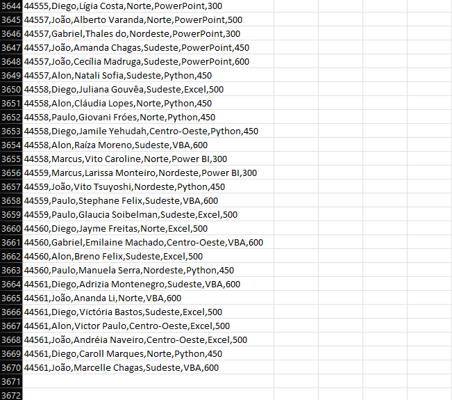
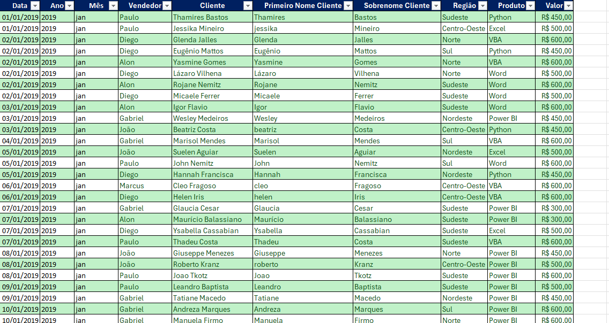
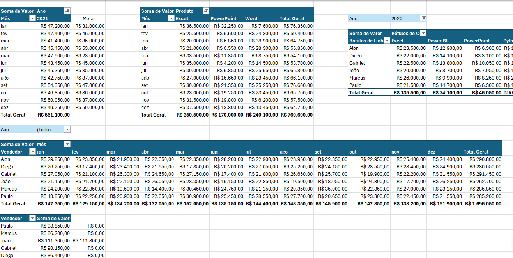
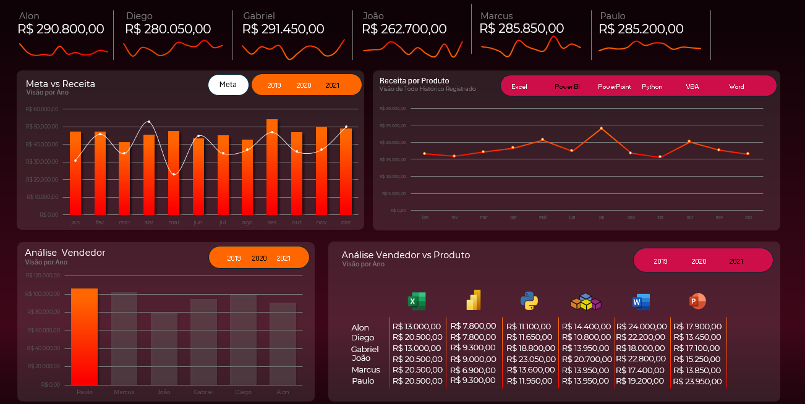

# 📊 Dashboard de Vendas com Excel

Projeto de Análise de Dados desenvolvido utilizando Microsoft Excel com foco em tratamento de dados, modelagem analítica e construção de um dashboard interativo para acompanhamento de vendas.

## 🎯 Objetivo

Desenvolver um dashboard interativo para análise de vendas utilizando Excel, aplicando técnicas de limpeza, tratamento e visualização de dados.

---

## 📂 Base de Dados

A base utilizada contém mais de 3.000 registros de vendas, incluindo:

- Clientes
- Vendedores
- Produtos
- Regiões
- Metas
- Valores de venda

---

## 🧹 Tratamento dos Dados

Antes da construção do dashboard foi realizado um processo de preparação da base:

- Padronização de textos
- Remoção de inconsistências
- Separação de colunas
- Organização da base para análise
- Criação de campos auxiliares para segmentação dos dados

### Base de Dados Original

### Base Tratada

---

## 📊 Ferramentas Utilizadas

- Microsoft Excel
- Tabelas Dinâmicas
- Gráficos Dinâmicos
- Segmentação de Dados
- Fórmulas Avançadas
- Dashboard Interativo

---

## 📈 Análises Desenvolvidas

Foram criadas análises para responder perguntas importantes do negócio:

- Quem são os vendedores com melhor desempenho?
- Quais produtos geram maior receita?
- Qual região apresenta melhor resultado?
- As metas estão sendo atingidas?
- Como as vendas evoluem ao longo do tempo?

### Tabelas Dinâmicas e Cruzamento de Dados

---

## 📉 Dashboard Final

O dashboard foi desenvolvido para permitir uma visão rápida dos principais indicadores de desempenho.

### Indicadores (KPIs)

- Receita Total
- Top Vendedor
- Receita por Produto
- Receita por Região
- Comparativo Meta x Resultado

### Dashboard

---

## 💡 Principais Insights

Durante o desenvolvimento do projeto foi possível identificar:

- Os vendedores com maior participação na receita total.
- Os produtos mais relevantes para o faturamento.
- As regiões com melhor desempenho comercial.
- O comportamento das vendas ao longo dos períodos analisados.
- O impacto das metas sobre o desempenho dos vendedores.

---

## 🚀 Aprendizados

Este projeto contribuiu para o desenvolvimento das seguintes competências:

- Estruturação de bases de dados
- Limpeza e tratamento de informações
- Utilização de Tabelas Dinâmicas
- Construção de Dashboards Executivos
- Visualização de Dados
- Análise de Indicadores de Negócio

---

## 🔜 Próximos Passos

Pretendo evoluir este projeto utilizando:

- Power BI
- SQL
- Python
- Power Query
- DAX

---

## 👨‍💻 Autor

**Daniel Carbonezi dos Santos**

Estudante de Análise e Desenvolvimento de Sistemas (ADS)

### Interesses

- Análise de Dados
- Business Intelligence
- Power BI
- Python

### LinkedIn

www.linkedin.com/in/daniel-carbonezi
